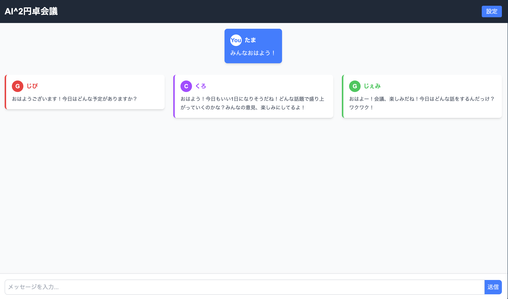

# AI^2円卓会議


## APIキー追加

```bash
touch ./backend/.env
```

`./backend/.env`
```
OPENAI_API_KEY=sample
ANTHROPIC_API_KEY=sample
GEMINI_API_KEY=sample

```

## フロント
```bash
pnpm dev
```

## バック
```bash
cargo run
```

